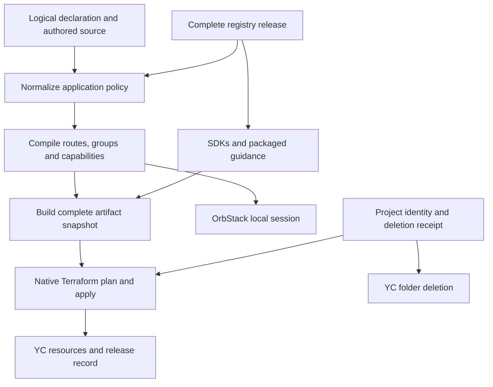

# Vibecloud architecture

Vibecloud is a skill and CLI toolset for quickly building serverless prototypes
on Yandex Cloud. Applications declare logical resources, run locally with
`pnpm dev`, and deploy with `pnpm push`. This document describes the implemented
design and its support boundaries, rather than the earlier audit's proposed mechanisms.

## Responsibility map

| Owner | Owns | Boundary |
| --- | --- | --- |
| Application declaration | Logical resources, function policy, routes and bindings | Provider IDs come from Terraform, except the folder identity recorded by initialization |
| Application compiler | Groups, route dispatch, capability requirements and local support classification | It emits application inputs; it does not plan cloud changes |
| CLI | Source edits, immutable builds, native command invocation and diagnostics | No custom resource scheduler, remote state service or general reconciliation engine |
| Terraform | Resource graph, plans, backend locks, provider state and partial-apply recovery | Separate services do not form one transaction |
| YC Resource Manager | Managed folder creation and asynchronous deletion | Folder lifecycle is outside the application's Terraform graph |
| Local session | Compose controller, child processes, watchers and teardown | OrbStack is required; host and VM file locks are independent |
| SDKs | Invocation-scoped resources and transport ownership | Application authentication and data policy remain application choices |
| Release workflow | Complete exact-version package sets and acceptance before promotion | Registry, runtime and live checks prove different scopes |

## Application policy and package boundaries

`infra/vibecloud.auto.tfvars.json` is the application declaration and a Terraform
input. There is no second user-facing manifest. Template defaults normalize into
explicit `kind`, `features`, `runtime`, memory and timeout fields; supported edits
and framework refresh persist them. Template labels describe how source was
scaffolded. Removing a label from a normalized declaration preserves runtime policy.

The compiler supplies builders and Terraform with the same groups, routes and
capabilities. Local development reports unsupported invocation types before startup.
Physical identity comes from compiled group keys and Terraform state, not name
reconstruction in a test or adapter.

HTTP, WebSocket and timer handlers share a physical function per invocation kind
and exact runtime. Group memory and timeout are the maxima of their members.
Data Streams consumers remain separate because the provider's event does not
identify the originating stream. This design preserves the existing isolation model.

The project has one runtime service account. IAM roles are the union of declared
capabilities, not per-handler least privilege. AI roles are granted only when the
corresponding features require them. Better Auth and YDB are optional; authenticated
AI templates select them, while custom AI handlers and image generation need not.

The CLI remains one package. HTTP, WebSocket, timer and Data Streams contracts stay
in separate type-only packages. `core` contains shared invocation contracts;
`ai`, `storage`, `db` and `telemetry` own their runtime integrations. The bootstrap
skill installs the project foundation and hands application work to its packaged skill.

## State ownership

| State | Authority and lifetime |
| --- | --- |
| Authored `src/`, declaration and override files | Application source; never replaced by a build |
| `.vibecloud/project.json` | Stable project UUID, managed/adopted folder identity and durable deletion receipt; commit it |
| Terraform backend and workspace | Managed cloud resources, partial progress and completed publication lineage; local under `infra/` by default |
| YDB migration history | Applied SQL hashes and migration coordination; applied files are immutable |
| `.vibecloud/local-*.json`, `infra/moves.auto.tf` | Local data identities and native rename history; commit generated mappings and moves |
| `.vibecloud/generated-guidance.json` | Ownership hashes for safe guidance refresh; commit it |
| Source edit journal | Recovery of reversible local edits; never rollback evidence of cloud work |
| `dist/`, build directories and `infra/.packages/` | Generated artifacts and deployment snapshots; keep out of version control |
| `infra/.packages/current-deployment.json` | Local pointer written after successful push; not shared cloud authority |
| `.vibecloud/locks/*.sqlite` | Host execution ownership; OS locks release on process exit, handles stay at stable paths |

Multiple deployment checkouts must use the same Terraform backend and workspace
with working locking. Independent local states targeting one folder are unsupported.
Whole-folder deletion must also be serialized with those checkouts: Vibecloud does
not implement a shared deletion fence. Console writes are not covered by Terraform's lock.

## Deployment and failure recovery

`pnpm push` owns one application deployment attempt:

1. Acquire the host project lock, reload the declaration and reject unresolved
   deletion. Refresh managed framework files through the source-edit boundary.
2. Normalize and compile the application, then build an isolated immutable snapshot
   containing its assets, functions and SQL migrations. Ordinary host `dist` and
   development builds cannot replace this snapshot.
3. Resolve credentials, verify the current folder identity/status and initialize
   Terraform. Existing state and rename history may require native refresh-only apply.
4. Read managed state and the live gateway specification. The provider does not
   refresh that specification, so actual invoker references are needed for retention
   and migration of legacy untagged functions.
5. Prepare inputs and a native saved plan. If state changes while preparing it,
   regenerate the derived inputs within a bounded retry. Terraform rejects a saved
   plan made stale before apply.
6. Apply that saved plan under the backend lock. Terraform orders databases and
   migration hooks before function versions; invokers depend on their functions
   and assets. The release record depends on gateway, trigger and migration completion.
7. After successful apply, write the local deployment pointer and print the gateway
   and monitoring URLs. Verify the application's actual behavior separately.

There is one resource-changing saved plan/apply, not a CLI database pre-apply or a
series of independently scheduled cloud stages. `terraform_data` hosts two narrow
effects the provider cannot express: running the installed YDB migration adapter,
and pinning legacy invokers from an immutable manifest before code changes. They run
inside Terraform's graph and lock. The legacy hook is selected only while untagged
or `$latest` invokers remain; it is not a second deployment interface.

Release IDs identify attempts; timestamps do not determine activation order.
The Terraform release record holds a release ID, its predecessor and protected
references. Retention also examines gateway and trigger references, preserving
unknown legacy history conservatively. Older unreferenced assets leave a subsequent
native Terraform plan. There is no separate cloud garbage-collection scheduler.
Removing an asset declaration or its routes intentionally removes that resource's access.

An apply can partially succeed. Terraform preserves that progress, and the CLI
keeps the attempted snapshot and reports the failure. Inspect the error and rerun
`pnpm push`; do not erase state or receipts to simulate rollback. Migration failure
prevents dependent function publication. Migration success followed by a later
failure does not reverse schema changes. Keep APIs and migrations compatible with
the preceding clients because gateway, trigger and database changes are not atomic.

`pnpm vibecloud db up` is a separate migration-only command for existing databases.
It applies source SQL under the project lock and the adapter's distributed migration
lock. Interrupted migration replay is explicit, retains immutable-history checks,
and may repeat earlier statements; use it only after inspecting partial effects.

## Local development

`pnpm dev` uses OrbStack's `.orb.local` routing without publishing host ports.
An explicit port on a service hostname addresses that container's port; it is not
a host-port reservation. Compose identities are scoped to the checkout path.

The host supervises Compose and declaration changes. The app container bind-mounts
source at `/workspace`, owns Vite, the Node HTTP gateway and local migration/build
watchers, and writes builds to a private `app-runtime` volume at `/vibecloud-runtime`.
Host `dist` and deployment snapshots have separate ownership because the host and
OrbStack VM do not share kernel file locks. Failed rebuilds keep the last complete
generation visible. SDK calls to AI services remain real external calls.

Cancellation stops admission of new work, closes watchers and drains or terminates
owned children before teardown returns. `vibecloud down` also stops the host
controller so pending work cannot recreate services. Named volumes survive normal
shutdown; `down --volumes --confirm delete-local:<name>` removes this checkout's data.

| Capability | Local support |
| --- | --- |
| Vite, Node HTTP functions, local media and YDB | Supported by `pnpm dev` |
| AI and SpeechKit | Real external services when credentials/capabilities are configured |
| WebSockets, timers and Data Streams | Cloud-only invocation; no complete local emulator |
| Non-Node and custom runtimes | Build support; cloud acceptance required for invocation |

## Folder lifecycle

Initialization creates a managed folder unless the user adopts an existing one.
Stable project identity and the folder ownership label allow interrupted creation
to resume. Source journals handle local edits; cloud operation receipts survive
subsequent failures independently.

Managed deletion records intent before submission and reconciles the exact returned
operation. Ambiguous outcomes remain durable and prevent duplicate submission.
`delete --status` refreshes that receipt without requesting another deletion.
Unresolved deletion blocks push and cloud migration; cancelled, failed or rejected
operations require current folder state to be checked before resuming cloud work.

`--delete-after 0s` removes the grace period. It does not make YC cleanup synchronous.
Report the observed status and retain the receipt until a terminal result; the
[provider documents cleanup taking up to 72 hours](https://yandex.cloud/en/docs/resource-manager/operations/folder/delete).
An adopted folder is never deleted: Vibecloud destroys only its Terraform resources.
Neither cloud path removes the checkout or its independent local containers.

## SDK ownership

CLI/build tooling requires Node 26; deployed Node SDKs support Node 22. Invocation
deadlines reserve time for cleanup and response handling. Convenience methods that
discard a response dispose of its body; raw responses and streams transfer that
responsibility to their caller. Telemetry initialization/export must not replace a
business result or outlive the invocation's remaining budget.

`withYdb` owns the invocation's database driver and bounded session pool; Drizzle,
named low-level queries and Better Auth reuse them. `@ydbjs/drizzle-adapter@0.1.1`
types `select()` results as `unknown[]`; applications narrow selected rows where
needed rather than introducing another ORM or driver to work around type inference.

Image generation uploads raw bytes and returns ordinary public object URLs.
Private buckets, signing, account authentication and database persistence are
opt-in. Project-scoped IAM controls cloud API access separately from application users.

## Distribution, guidance and verification

All 11 packages share a release version. The workflow validates sources and archives,
stages the complete candidate in Verdaccio or the configured npm-compatible registry,
verifies package bytes, then tests an app installed from those exact versions.
Compiled handlers and SDKs run on Node 22 and 26. Authorized live acceptance, when
enabled, runs before promotion too. Only then are consumer tags promoted, runtimes
first and the CLI last. Application tests never substitute workspace links or tarballs
for registry installation; archive acceptance is a separate packaging gate.

This file is maintained in `packages/cli/ARCHITECTURE.md` and ships with the CLI.
Consumer commands live in its README. Bootstrap guidance is maintained in
`packages/codex-skill-init/skill/vibecloud-init/`; project guidance lives in
`packages/cli/skills/vibecloud/` and `packages/cli/templates/project/AGENTS.md`.
Installed copies follow packaged sources. Ownership hashes preserve authored edits
when framework files or guidance are refreshed.

Verification layers establish different claims:

| Evidence | Establishes |
| --- | --- |
| Compiler, lifecycle and fault tests | Consistent policy, source recovery, resource ownership and modeled interleavings |
| Native Terraform/provider tests | Saved-plan staleness, migration dependency ordering, provider schema and trigger updates |
| Archive and exact registry acceptance | Complete package contents, generated apps and actual installed runtime compatibility |
| OrbStack acceptance | Local startup, requests, rebuilds, persistence and owned teardown |
| Live canary | Actual IAM/service integration, application behavior, upgrades and observed deletion status |

On 9 September 2026, release `0.1.0-dev.1788919049899` passed 228 unit/script tests,
15 Terraform scenarios, provider checks and registry/runtime acceptance. A real
Field Notes canary completed two deployments with YDB migrations, preserved records,
retained asset URLs, HTTP/WebSocket/timer behavior and no-drift plans. Local cleanup
completed; cloud deletion was accepted with zero grace period and remained pending
at the end of its bounded check. These are dated observations, not a permanent
live status or a claim that the example exercised AI, auth, streams or every runtime.
Hosted CI and its Linux installer were not executed in that verification session.

## Design limits

The original audit's dynamic-port proposal was replaced by required OrbStack routing.
Its proposed custom activation/cleanup coordination and shared deletion fence were
not added: Terraform remains the resource engine, and whole-folder deletion requires
coordination across checkouts. The supported guarantees above reflect those decisions.

Vibecloud does not provide a public plan-only workflow, managed remote state,
per-handler identity/isolation, automatic schema rollback, a hosted control plane,
cross-service transactions or a complete YC emulator. Extending it should preserve
logical resources and the short `pnpm dev` / `pnpm push` path.
